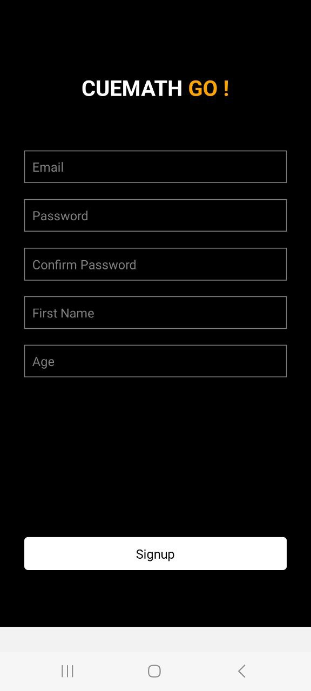
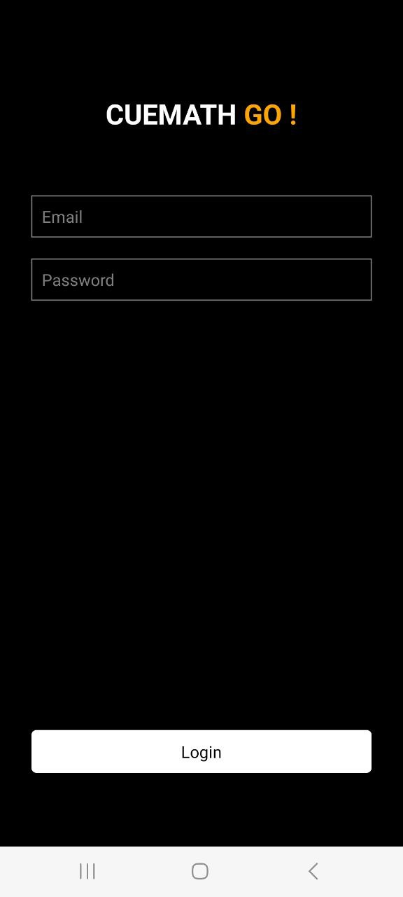
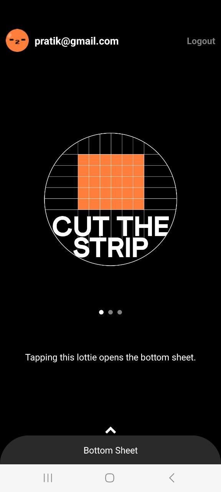
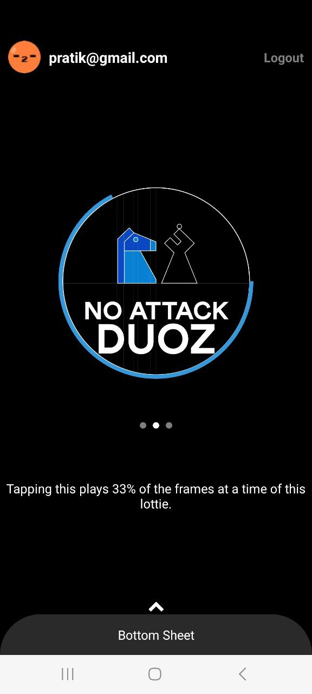
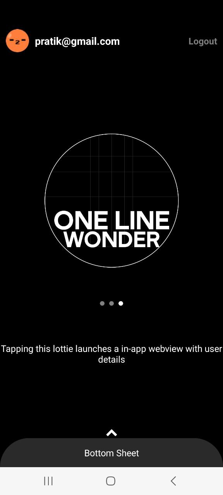

# Cuemath Go !

## Project Type

React native

## Directory Structure

nativeapp/

## Video Walkthrough of the project

Attach a very short video walkthough of all of the features [ 1 - 3 minutes ]

## Video Walkthrough of the codebase

Attach a very short video walkthough of codebase [ 1 - 5 minutes ]

## Features

- Signup
- Login
- Scrollable
- tab indicator

## Installation & Getting started

```bash
clone project
 npm install
npx expo start (expo go app should be in your mobile)

```










## Technology Stack


- React native 
- Expo

